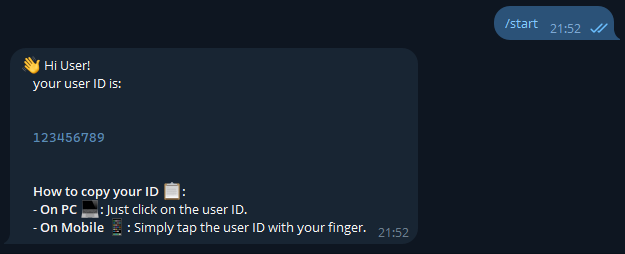

<div id="top"></div>
<br/>
<br/>

<p align="center">
  
</p>

<h1 align=center>
    <a href="https://github.com/Armaggheddon/whoami_bot">whoami_bot</a>
</h1>

<p align="center">
<a href="https://github.com/Armaggheddon/whoami_bot/commits/main">

</a>
<a href="https://github.com/Armaggheddon/whoami_bot">

</a>
<a href="https://github.com/Armaggheddon/whoami_bot/issues">

</a>
<a href="https://github.com/Armaggheddon/whoami_bot/blob/master/LICENSE">

</a>
<!--<a href="https://github.com/Armaggheddon/whoami_bot">

</a> -->
</p>

<p align="center">
Welcome to <b>whoami_bot</b>! This is the simplest Telegram bot ever — all it does is tell you who you are! 🚀 Send it a message, and it’ll reply with your Telegram User ID. That’s it! 🎯
</p>

## 🛠️ Installation
Setting up **whoami_bot** is as easy as pie! 🍰 Just follow these quick steps:

- Clone this repo (or download it, if you prefer!)
    
- Install the requirements
    ```bash
    pip install -r requirements
    ```

Boom! 💥 You’re done! Ready to roll!


## 🏁 Usage
To get started, follow these steps:

1. Set your Telegram bot token in the [`src/bot/whoami_bot`](/src/bot/whoami_bot.py) file. 📝
    ```python
    TELEGRAM_BOT_TOKEN="YOUR_TELEGRAM_BOT_TOKEN"
    ```
1. Run the bot
    ```bash
    python3 src/main.py
    ```

And you’re good to go! 🎉 Send the bot any message, and it will reply with your User ID.

<p align="center">
  
</p>


## 🤔 What does it do?

Simple:

- You send the bot any message.
- It replies with your User ID. 🎉

Perfect for when you need to check your Telegram ID for other bots or apps! 💡